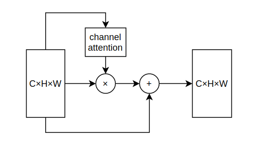
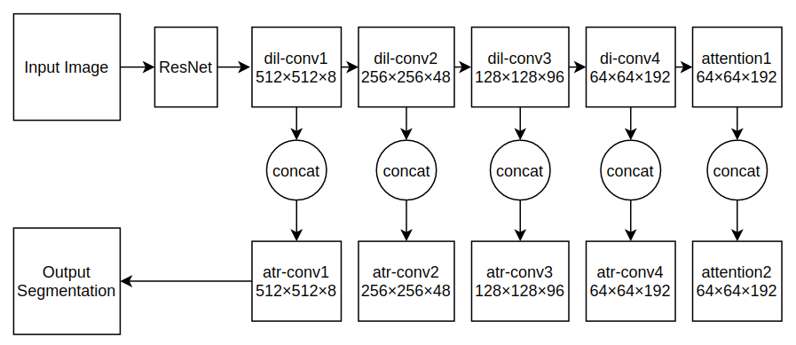
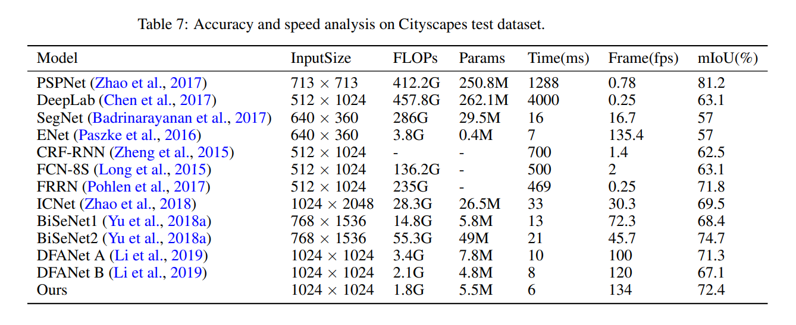

# Semantic Segmentation With Multi Scale Spatial Attention For Self Driving Cars

Code for the paper `Semantic Segmentation With Multi Scale Spatial Attention For Self Driving Cars`.

https://arxiv.org/pdf/2007.12685

## Abstract

In this paper, we present a novel neural network using multi scale feature fusion
at various scales for accurate and efficient semantic image segmentation. We
used ResNet based feature extractor, dilated convolutional layers in downsampling
part, atrous convolutional layers in the upsampling part and used concat operation
to merge them. A new attention module is proposed to encode more contextual
information and enhance the receptive field of the network. We present an in depth
theoretical analysis of our network with training and optimization details. Our
network was trained and tested on the Camvid dataset and Cityscapes dataset using
mean accuracy per class and Intersection Over Union (IOU) as the evaluation
metrics. Our model outperforms previous state of the art methods on semantic
segmentation achieving mean IOU value of 74.12 while running at >100 FPS.

## Data

1. `Camvid dataset`: The Cambridge-driving Labeled Video Database (CamVid) is a collection of
videos with object class semantic labels, complete with metadata. The database provides ground truth
labels that associate each pixel with one of 32 classes. The images are of size 360×480. The original
images are taken as ground truth. For any algorithm, the metrics are always evaluated in comparison
to the ground truth data. The ground truth information is provided in the dataset for the training and
test set.

2. `Cityscapes dataset`: This dataset contains urban street scenes images from 50 different cities. The
images are divided into 5,000 finely annotated images and 19,998 coarsely annotated images. The
total number of classes in the dataset is 30, but we have only used 19 classes for both training and
evaluation. The images in training, validation and test set are 2,975, 500, 1,525 respectively.

Set up the folders in the following manner:

```
├── "dataset_name"                   
|   ├── train
|   ├── train_labels
|   ├── val
|   ├── val_labels
|   ├── test
|   ├── test_labels
```

## Channel Attention Module



## Network Architecture



## Usage

Training: `python train.py`

Testing: `python test.py`

Testing on a single image: `python predict.py`

## Evaluation Metrics

1. `Mean Accuracy per-class` - This metric outputs the class wise prediction accuracy per pixel.

2. `Mean IOU` - It is a segmentation performance parameter that measures the overlap between two
objects by calculating the ratio of intersection and union with ground truth masks. This metric is also
known as Jaccard Index.

## Results

### Loss and Accuracy vs epochs:


### Comparision with SOTA using Camid dataset:


### Comparision with SOTA using Cityscapes dataset:



### Results using CamVid dataset. First column: input image from dataset, second column: predicted segmentation from our network and third column: ground truth segmentation.


## Citing

If you find this code useful in your research, please consider citing the paper:

BibTex:

```
@article{sagar2020semantic,
  title={Semantic Segmentation With Multi Scale Spatial Attention For Self Driving Cars},
  author={Sagar, Abhinav and Soundrapandiyan, RajKumar},
  journal={arXiv preprint arXiv:2007.12685},
  year={2020}
}
```

MLA:

`Sagar, Abhinav, and RajKumar Soundrapandiyan. "Semantic Segmentation With Multi Scale Spatial Attention For Self Driving Cars." arXiv preprint arXiv:2007.12685 (2020).`


## License

```
MIT License

Copyright (c) 2020 Abhinav Sagar

Permission is hereby granted, free of charge, to any person obtaining a copy
of this software and associated documentation files (the "Software"), to deal
in the Software without restriction, including without limitation the rights
to use, copy, modify, merge, publish, distribute, sublicense, and/or sell
copies of the Software, and to permit persons to whom the Software is
furnished to do so, subject to the following conditions:

The above copyright notice and this permission notice shall be included in all
copies or substantial portions of the Software.

THE SOFTWARE IS PROVIDED "AS IS", WITHOUT WARRANTY OF ANY KIND, EXPRESS OR
IMPLIED, INCLUDING BUT NOT LIMITED TO THE WARRANTIES OF MERCHANTABILITY,
FITNESS FOR A PARTICULAR PURPOSE AND NONINFRINGEMENT. IN NO EVENT SHALL THE
AUTHORS OR COPYRIGHT HOLDERS BE LIABLE FOR ANY CLAIM, DAMAGES OR OTHER
LIABILITY, WHETHER IN AN ACTION OF CONTRACT, TORT OR OTHERWISE, ARISING FROM,
OUT OF OR IN CONNECTION WITH THE SOFTWARE OR THE USE OR OTHER DEALINGS IN THE
SOFTWARE.
```

